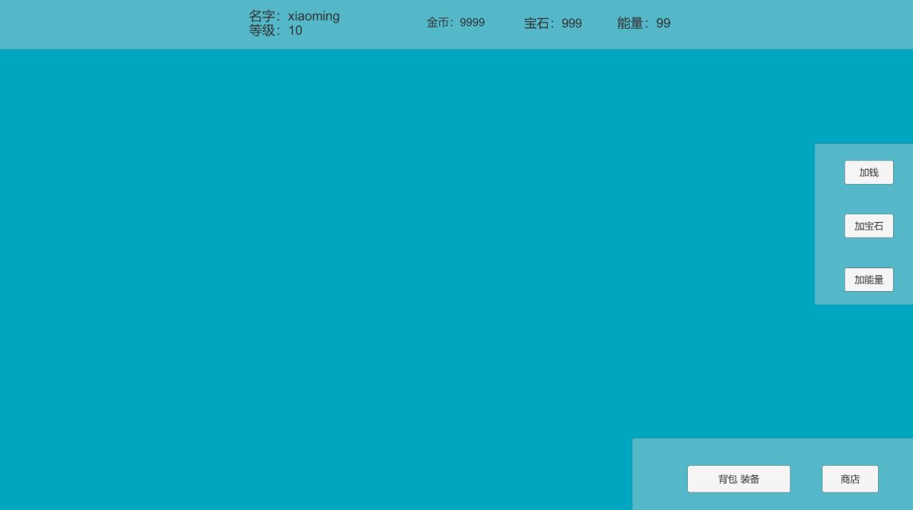
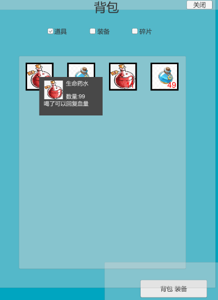

# Unity使用C#实现背包系统、商店系统、装备系统

## 主UI面板

 

1. 实现了基础的角色面板展示，包括角色名称、等级、金币数量、宝石数量、能量等数据，使用Json来记录持久化角色信息
2. 为了方便调试，加入加钱、加宝石、加能量的接口
3. 提供背包、装备、商店系统的启动按钮
4. 所有的UI模块均高度的复用化，争取用最少的逻辑来实现功能

## 背包系统

  

1. 打开背包后，可以查看道具、装备、碎片三个分栏
2. 鼠标停留在UI上后可查看详情
3. 实现了道具、碎片的堆叠上限
4. 所有的道具数据通过Excel转换为Json再反序列化为类对象

```json
{
  "info":
  [
    {
      "id": 1,
      "name": "长剑",
      "icon": "1",
      "type": 2,
      "equipType": 3,
      "price": 350,
      "tips": "普通的长剑"
    },
    {
      "id": 2,
      "name": "盔甲",
      "icon": "2",
      "type": 2,
      "equipType": 4,
      "price": 500,
      "tips": "普通的盔甲"
    },
    {
      "id": 3,
      "name": "生命药水",
      "icon": "3",
      "type": 1,
      "equipType": 0,
      "price": 50,
      "tips": "喝了可以回复血量"
    },
    {
      "id": 4,
      "name": "法力药水",
      "icon": "4",
      "type": 1,
      "equipType": 0,
      "price": 50,
      "tips": "喝了可以回复法力值"
    },
    {
      "id": 5,
      "name": "红水晶",
      "icon": "5",
      "type": 3,
      "equipType": 0,
      "price": 400,
      "tips": "红色的宝石"
    },
    {
      "id": 6,
      "name": "蓝水晶",
      "icon": "6",
      "type": 3,
      "equipType": 0,
      "price": 300,
      "tips": "蓝色的宝石"
    },
    {
      "id": 7,
      "name": "武士盔甲",
      "icon": "7",
      "type": 2,
      "equipType": 4,
      "price": 3000,
      "tips": "武士的盔甲"
    }
  ]
}
```

## 商店系统

 

1. 所有的商店数据通过Excel转换为Json再反序列化为类对象
2. 购买成功后弹出提示窗口提示购买成功/金币不足

## 装备系统 

 

 

1. 提供了六个装备栏位分别是Head、Neck、Weapon、Cloth、Trousers、Shoes
2. 通过鼠标对装备的拖拽，实现角色装备和背包装备的装备、脱下、切换等操作
